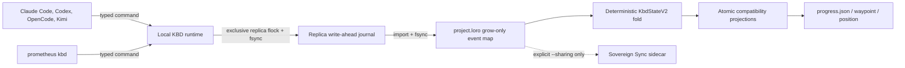

# Canonical KBD Control Plane

The canonical KBD runtime is a local, event-sourced authority used directly by
the CLI and native harness adapters. Sovereign Sync can replicate that state
when sharing is explicitly enabled, but it is not in the ordinary command path.
This replaces the old model in which multiple tools could independently edit
`progress.json`, `position.json`, or `current-waypoint.json`.

## Authority model



The per-project Loro document is authoritative. Replica journals are durable
write-ahead ingestion logs: a successful command fsyncs its journal, imports
and fsyncs `project.loro`, then updates projections. Compatibility files exist for
readers and older skills, but a direct file edit cannot:

- change the committed lifecycle;
- revise a plan;
- enroll a device;
- satisfy an expected-revision check.

Plain setup and ordinary `--full` setup keep all current and legacy
Sovereign Sync service identities stopped and disabled. Use `--full --sharing`
only when another enrolled machine must receive the local journal. A stopped
sidecar therefore cannot block local status, typed mutations, boundaries,
memory recall, or certification.

## Immutable project identity

Each controlled repository has `.prometheus/project.json`:

```json
{
  "schemaVersion": "1",
  "projectId": "7ce3f728-365d-4c80-9df0-2e0b1540995c",
  "repositoryFingerprint": "sha256:…"
}
```

The UUID names the runtime and REST resource. The fingerprint, Git origin,
HEAD, and path are duplicate-detection evidence only; none may create, infer,
or merge project identity. Do not copy a manifest between unrelated repositories.

Read the ID without hard-coding it:

```bash
PROJECT_ROOT="/path/to/project"
PROJECT_ID="$(jq -r '.projectId' "$PROJECT_ROOT/.prometheus/project.json")"
printf '%s\n' "$PROJECT_ID"
```

## Runtime location

The canonical runtime is outside the Git working tree:

| Platform | Default root |
|---|---|
| macOS | `$HOME/Library/Application Support/prometheus/kbd/projects/<project-id>/` |
| Linux | `${XDG_DATA_HOME:-$HOME/.local/share}/prometheus/kbd/projects/<project-id>/` |
| Override | `$PROMETHEUS_DATA_DIR/prometheus/kbd/projects/<project-id>/` |

Typical contents include:

```text
project.loro
project.loro.lock
replicas/<replica-id>/events.jsonl
replicas/<replica-id>/runtime.lock
events.v1.jsonl.archive
events.v1.jsonl.archive.sha256
JOURNAL-MIGRATION-ROLLBACK.md
```

Signing keys may live in the platform credential store. Headless services use
an explicit permission-protected key file instead.

## Event integrity

Each event contains project and replica IDs, Lamport order, actor ID, command
ID, its preparation frontier, a per-replica previous hash, and signature
metadata. Events are serialized canonically, hash chained per replica, and
signed with Ed25519. Folding verifies:

- continuous per-replica Lamport order;
- causal-frontier reachability;
- per-replica previous-event hashes;
- canonical event hashes;
- signer identity and public key;
- device enrollment/revocation state;
- deterministic state reduction.

## Command contract

All mutation surfaces use the same versioned envelope:

```json
{
  "schemaVersion": "2",
  "projectId": "7ce3f728-365d-4c80-9df0-2e0b1540995c",
  "runId": "phase-example-20260728T120000Z",
  "commandId": "a fresh UUID",
  "frontier": {
    "replica-uuid-a": 12,
    "replica-uuid-b": 5
  },
  "actor": {
    "kind": "harness",
    "id": "operator",
    "device": "workstation",
    "harness": "claude-code",
    "session": "session-id"
  },
  "command": {
    "type": "pause",
    "payload": {"reason": "Operator checkpoint"}
  }
}
```

`commandId` makes retries idempotent: a duplicate returns the original
committed result instead of appending a second event. `expectedRevision`
is accepted only by the schema-v1 single-writer compatibility adapter. Normal
schema-v2 writes compare the supplied causal frontier. One exclusive replica
lock covers read, fold, identity/idempotency/frontier validation, event
preparation, append, and journal fsync; the Loro snapshot is fsynced before the
write is acknowledged.

REST mutation bodies wrap this inner command as
`{"command":{…},"signerKeyId":"ed25519:…","signature":"…"}`. The server
accepts only schema-v2 commands signed by an active enrolled device. The CLI
and MCP adapters sign through the runtime device identity rather than exposing
key material to shell or browser code.

## State model

`KbdStateV2` contains:

- run, lifecycle, derived revision, causal frontier, and immutable plan revision;
- pause checkpoint and exact next work;
- active phase/stage/change/task path;
- phase, stage, change, and task records;
- implementation, evidence, certification, and publication completion;
- decisions and blockers;
- visible conflict candidates, provisional winners, and signed adjudications;
- shared/exclusive CRDT claims with scope, TTL, holder, replica, and monotonic token;
- device trust records;
- command-to-revision idempotency records.
- outstanding before/after boundary obligations and the latest gate summary.

Boundary receipts bind phase and task ordinals to the authoritative source
revision. Their stable identity makes retries harmless and prevents a stale
projection or direct `/opsx:apply` invocation from claiming completion without
the corresponding KBD receipt. See [Control-plane recovery](./control-plane-recovery).

Use the CLI to inspect it:

```bash
prometheus kbd --path "$PROJECT_ROOT" status --json | jq .
prometheus kbd --path "$PROJECT_ROOT" audit --json | jq .
prometheus kbd --path "$PROJECT_ROOT" claim list --json | jq .
prometheus kbd --path "$PROJECT_ROOT" claim acquire phase:example --mode exclusive --ttl 900
```

Concurrent incompatible claims remain visible. The provisional winner is
selected by `(lamport, holderId)`; the losing holder's intersecting writes are
rejected with the winning event, current frontier, and a manual rebase
instruction. Shared claims coexist. Singleton lifecycle, active-path, and
completion writes require the current frontier; offline concurrency emits a
`singleton_violation` and requires operator adjudication.

See [Migration and rollout](./migration-and-rollout) for importing legacy
state.
