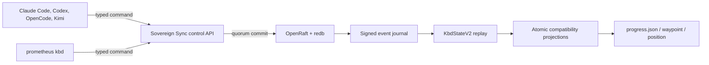

# Canonical KBD Control Plane

The canonical KBD runtime is an event-sourced control plane shared by the CLI,
Sovereign Sync REST and MCP surfaces, and native harness adapters. It replaces
the old model in which multiple tools could independently edit
`progress.json`, `position.json`, or `current-waypoint.json`.

## Authority model



The committed event sequence is authoritative. Compatibility files exist for
readers and older skills, but a direct file edit cannot:

- change the committed lifecycle;
- claim or transfer a lease;
- increment the fencing generation;
- revise a plan;
- enroll a device;
- satisfy an expected-revision check.

## Immutable project identity

Each controlled repository has `.prometheus/project.json`:

```json
{
  "schemaVersion": "1",
  "projectId": "7ce3f728-365d-4c80-9df0-2e0b1540995c",
  "repositoryFingerprint": "sha256:…"
}
```

The UUID names the runtime and REST resource. The fingerprint binds that
identity to the repository’s Git remote, or to its canonical path when no
remote exists. Do not copy a manifest between unrelated repositories.

Read the ID without hard-coding it:

```bash
PROJECT_ROOT="/path/to/project"
PROJECT_ID="$(jq -r '.projectId' "$PROJECT_ROOT/.prometheus/project.json")"
printf '%s\n' "$PROJECT_ID"
```

## Runtime location

The canonical runtime is outside the Git working tree:

| Platform | Default root |
|---|---|
| macOS | `$HOME/Library/Application Support/prometheus/kbd/projects/<project-id>/` |
| Linux | `${XDG_DATA_HOME:-$HOME/.local/share}/prometheus/kbd/projects/<project-id>/` |
| Override | `$PROMETHEUS_DATA_DIR/prometheus/kbd/projects/<project-id>/` |

Typical contents include:

```text
events.jsonl
runtime.lock
control-token
deferred-hooks/
raft.redb
```

Signing keys may live in the platform credential store. Headless services use
an explicit permission-protected key file instead.

## Event integrity

Each event contains a revision, previous hash, actor, command result, and
signature metadata. Events are serialized canonically, hash chained, and
signed with Ed25519. Replay verifies:

- continuous revisions;
- previous-event hashes;
- canonical event hashes;
- signer identity and public key;
- device enrollment/revocation state;
- deterministic state reduction.

## Command contract

All mutation surfaces use the same versioned envelope:

```json
{
  "schemaVersion": "1",
  "projectId": "7ce3f728-365d-4c80-9df0-2e0b1540995c",
  "runId": "phase-example-20260728T120000Z",
  "commandId": "a fresh UUID",
  "expectedRevision": 17,
  "actor": {
    "kind": "harness",
    "id": "operator",
    "device": "workstation",
    "harness": "claude-code",
    "session": "session-id"
  },
  "leaseId": "current lease UUID",
  "fencingToken": 4,
  "command": {
    "type": "lease_heartbeat"
  }
}
```

`commandId` makes retries idempotent: a duplicate returns the original
committed result instead of appending a second event. `expectedRevision`
provides optimistic concurrency. Lease-protected mutations additionally
require the current lease ID and fencing token.

## State model

`KbdStateV2` contains:

- run, lifecycle, revision, and immutable plan revision;
- pause checkpoint and exact next work;
- current lease and last fencing token;
- active phase/stage/change/task path;
- phase, stage, change, and task records;
- implementation, evidence, certification, and publication completion;
- decisions and blockers;
- device trust records;
- command-to-revision idempotency records.

Use the CLI to inspect it:

```bash
prometheus kbd --path "$PROJECT_ROOT" status --json | jq .
prometheus kbd --path "$PROJECT_ROOT" audit --json | jq .
```

See [Leases and handoffs](./leases-and-handoffs) for writer ownership and
[Migration and rollout](./migration-and-rollout) for importing legacy state.
