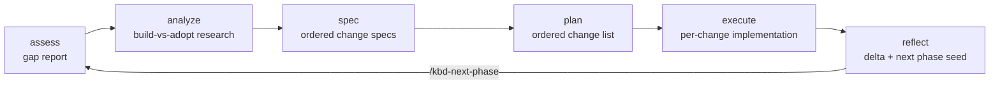

# KBD Lifecycle

KBD (Knowledge-Based Development) is the pack's stage-gated engineering
lifecycle. The current implementation separates two concerns:

- The **canonical control plane** stores signed, hash-chained events and
  deterministically replays them into `KbdStateV2`.
- The **compatibility projection** writes familiar files under
  `.kbd-orchestrator/` so skills and older integrations can read phase
  artifacts without becoming competing state writers.

Every phase still moves through six stages, but `progress.json`,
`current-waypoint.json`, and `position.json` are now revision-stamped views of
the committed runtime. They are not the authority for lifecycle transitions
or command ordering.

Each stage fires `before`/`after` hooks, writes a handoff summary the next
stage reads first, and emits plain-text progress signals
(`Starting kbd-assess — <phase> (step N of T)`).

## What the control plane protects

The runtime coordinates Claude Code, Codex, OpenCode, Kimi, CLI operators, and
Sovereign Sync around one ordered history:

- immutable project identity in `.prometheus/project.json`;
- lifecycle and pause checkpoints;
- immutable plan revisions and exact next work;
- active phase, stage, change, and task;
- implementation, evidence, certification, and publication completion;
- decisions and blockers;
- enrolled or revoked signing devices;
- a single exclusive journal transaction for each command;
- idempotent command results keyed by `commandId`.

Every mutation supplies the expected committed revision. A stale harness
cannot regain authority by editing a JSON file, and concurrent commands are
serialized across replay, validation, append, and fsync by one journal lock.

## Start here

- [Canonical control plane](./control-plane): runtime, identity, events, and projections
- [Tokens and authentication](./tokens-and-authentication): bearer token, operator ID, and device key
- [Tool guards](./bash-mutation-guard): the one remaining write guard, and why the Bash fence was removed
- [Operator controls](./operator-controls): pause, revise, resume, cancel, and audit
- [Migration and rollout](./migration-and-rollout): importing legacy ledgers and canary gates
- [Troubleshooting](./troubleshooting): error-to-remediation lookup

*Canonical source: [`kbd-process-orchestrator`](https://github.com/Prometheus-AGS/prometheus-skill-system/tree/main/skills/process/kbd-process-orchestrator) — the orchestrator
SKILL.md and its references are the source of truth. Deep-dive narrative:
[Metaprompting, PMPO & KBD](/docs/guide/metaprompting-pmpo-kbd).*
