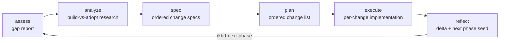

# KBD Lifecycle

KBD (Knowledge-Based Development) is the pack's stage-gated engineering
lifecycle. Every phase moves through six stages, each writing durable
artifacts under `.kbd-orchestrator/phases/<phase>/` so any AI tool can
resume from disk state.

Each stage fires `before`/`after` hooks, writes a handoff summary the next
stage reads first, and emits plain-text progress signals
(`Starting kbd-assess — <phase> (step N of T)`).

*Canonical source: [`kbd-process-orchestrator`](https://github.com/Prometheus-AGS/prometheus-skill-system/tree/main/skills/process/kbd-process-orchestrator) — the orchestrator
SKILL.md and its references are the source of truth. Deep-dive narrative:
[Metaprompting, PMPO & KBD](/docs/guide/metaprompting-pmpo-kbd).*
