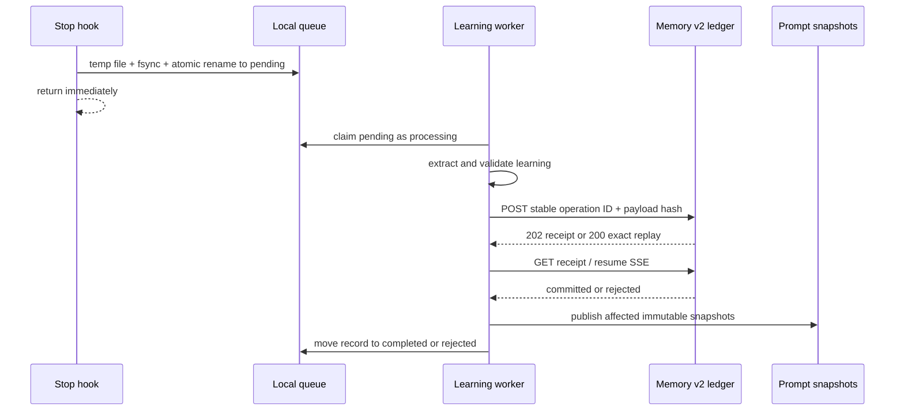

# Hooks, worker, queues, and receipts

The Stop hook is intentionally small: classify the event, validate scope, atomically publish a local queue record, and return. It performs no inference, network request, service-manager operation, or synchronous memory writeback.



## Queue state machines

Learning jobs use `pending → processing → completed | rejected`. Legacy `retry` and `dead-letter` directories are migration evidence and must be empty after reconciliation.

Memory delivery uses `pending → submitting → accepted → completed | rejected`. The `submitting` rename happens before the network call, so a worker crash cannot erase uncertainty. On restart, the worker reuses the same operation ID and hash; `200` replay and GET reconciliation determine truth.

## Stable operation identity

The operation ID derives from the method plus canonical arguments. Reprocessing the same queue record therefore cannot create a second logical memory. An ID/hash conflict is quarantined as rejected evidence, not overwritten.

## Worker operation

`prometheus-learning-worker` is installed as a user service. A path watcher or timer wakes it when work appears. Only one worker owns a record at a time; stale claims are reconciled from durable queue and receipt state rather than retry counters.

Inspect current state with:

```bash
prometheus learning status --json
pk doctor --json
```

Both commands diagnose only. They do not create snapshots, mutate queue records, or submit memory operations.

