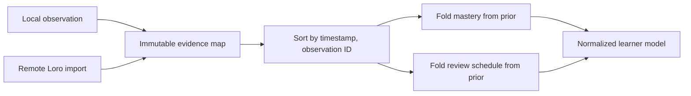

# Loro evidence and migration

The learner model uses Loro for persisted and replicated state. Mastery and
review scheduling are derived values; immutable observations are the evidence.
This separation prevents import order from becoming a hidden source of truth.



## Evidence contract

Every observation has a globally unique `observation_id`, timestamp, score,
source skill, vector clock, and optional retention rating. Observations live in
a map keyed by that ID. Re-importing the same evidence is idempotent, and two
devices cannot create duplicate counters merely because their updates arrive in
different orders.

After every local write or remote import, the model sorts evidence by timestamp
and observation ID and recomputes derived state from immutable priors. The fold
applies these conservative invariants:

- mastery remains in `[0, 1]` and uses the prior until five observations exist;
- the next due date never becomes later solely because replicas merged;
- repetitions and lapse counters never fall below their prior values;
- identical evidence sets produce identical mastery and scheduling state.

These properties are tested for commutativity, associativity, idempotency, and
permutation independence.

## Legacy snapshot migration

Loading an older model normalizes it to schema `1.1.0`. A legacy observation
array becomes a keyed map. When an observation lacks an ID, the migrator creates
a deterministic `legacy-<blake3>` ID from its canonical content and original
position. Existing mastery and FSRS state become immutable priors before the
evidence fold runs.

Before writing the normalized Loro document, the store saves the original bytes
at:

```text
learner/<learner-id>/migrations/pre-1.1-<blake3>.loro
```

The content-addressed name makes migration repeatable and prevents duplicate
backups. The original snapshot is never deleted.

## Use cases

- **Two-device study:** both devices record offline observations; importing
  either update first yields the same final model.
- **Lost response:** a client may retry the evidence write without increasing
  review counters twice because the evidence ID is stable.
- **Conservative reminders:** a merge cannot postpone an already-earlier review
  or reduce the evidence history.
- **Migration audit:** an operator can compare the normalized document with the
  archived pre-migration Loro snapshot.

Do not edit mastery or FSRS counters as independent replicated facts. Add or
correct evidence and let the canonical fold derive the model.
