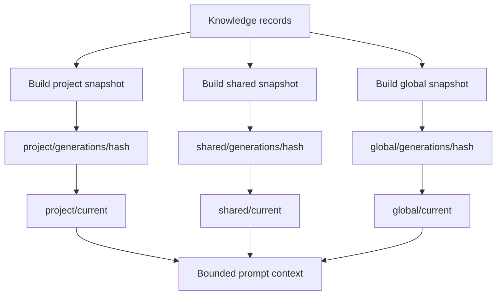

# Immutable snapshots and bounded context

Knowledge and learning use three isolated scopes:

- **Project**: repository-specific decisions and current work.
- **Shared**: reusable knowledge intentionally shared across related projects.
- **Global**: stack-wide lessons and durable operator feedback.

Each scope publishes an immutable generation and atomically advances a `current` pointer. Readers resolve one complete generation; they never observe a half-written context file.

## Publication contract

Writers build and validate a new generation away from `current`, fsync the payload and parent directory, then atomically replace the pointer. Existing generations remain available for audit and rollback.

Readers validate the generation name, manifest, content hash, scope, and size budget. Missing or invalid snapshots are an explicit doctor failure; readers do not silently fall back to mutable source directories.

## Bounded prompt context

Prompt assembly uses a fixed total budget and per-scope limits. Selection is deterministic: scope precedence, stable relevance ordering, then stable record identity. Oversized records are summarized or omitted with evidence; the runtime does not dump the complete knowledge base into a prompt.

This design gives concurrent hooks and workers a stable view while a new snapshot is being published, and keeps project facts from leaking into shared or global scope.

