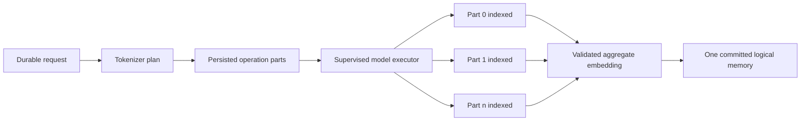

# Executor, readiness, and recovery

An `add_memory` operation is planned with the active model tokenizer. The ledger persists every part’s index, token range, token count, content hash, content, embedding state, and update time before completion can be acknowledged.

## Supervised execution

The executor owns a generation number and monotonic progress sequence. It emits durable start, progress, exit, restart, and completion evidence. The operation receipt projects this evidence through `executor_generation`, `executor_progress_seq`, `executor_exit_count`, `executor_last_exit`, and `executor_error`.

An executor exit is not converted into success or terminal rejection. The operation remains recoverable. A restarted generation reuses the persisted plan and skips parts already marked `indexed` with an embedding.

## Readiness

`GET /health` proves only that the API process can respond. `GET /ready` separates durable ingestion from model/search warming:

- `capabilities.ledger`, `storage`, and `coordinator` must be true;
- `ingestion_ready` must be true before accepting writes;
- tokenizer, model executor, and search index may be false during warm-up;
- unavailable ledger readiness returns `503`.

## Watchdog semantics

Watchdogs supervise forward progress, not wall-clock success. They may restart a stalled or exited model generation, but they never infer that a write committed because a retry count was exhausted. Terminal truth comes only from the operation ledger.

## Restart and kill recovery

After an API or executor restart:

1. reload every non-terminal operation in deterministic ID order;
2. reload its persisted tokenizer plan and executor snapshot;
3. reuse indexed parts and resume unfinished parts;
4. append monotonic events;
5. commit exactly one logical memory when all parts validate.

Use `scripts/certify-memory-operations.sh --long-memory` to certify health, readiness, response-loss reconciliation, exact replay, hash conflict, terminal receipt retrieval, and SSE resume against a running local server.

