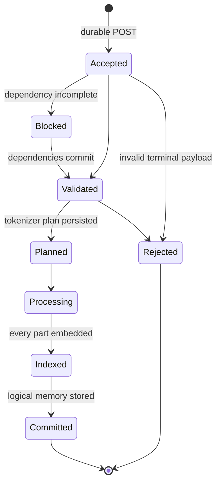

# Memory

Prometheus Memory is a local-first knowledge graph and scoped memory service. Version 2 changes the correctness boundary: an HTTP timeout is not success or failure, and process liveness is not write readiness. A caller submits a durable operation, retains its `operation_id`, and reconciles the terminal receipt.

Use it when you need:

- project, shared, or global memories that survive process and machine restarts;
- idempotent ingestion from hooks and background workers;
- one logical memory larger than a model window;
- deterministic recovery after response loss or executor interruption;
- an auditable event history instead of retry-count inference.

The REST operation ledger is canonical for durable writes. Existing read/search and MCP surfaces remain useful, but new integrations should acknowledge writes through `/api/v2/operations`.

## Correctness rules

1. Treat `202 Accepted` as durable acceptance, not completion.
2. Treat only `committed` or `rejected` as terminal.
3. Reuse the same `operation_id` and canonical `payload_hash` after uncertainty.
4. A `409 Conflict` means the ID already protects a different payload; do not overwrite it.
5. Resume SSE from the last processed sequence, or poll the receipt when streaming is unavailable.
6. Gate ingestion on `/ready`, not `/health`.

Next: [Operation API](./operation-api.md) and [Executor and recovery](./executor-and-recovery.md).

