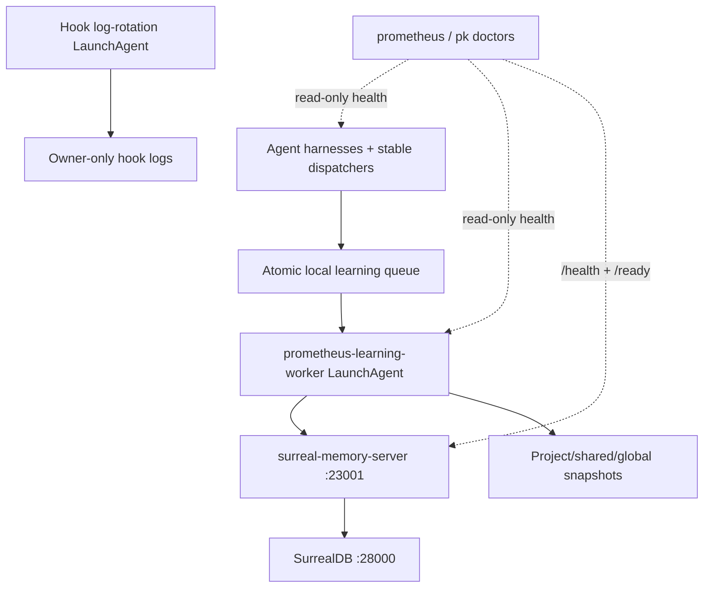

# Doctors and Mac certification

Run diagnosis with explicit exclusions before any repair:

```bash
prometheus doctor --json \
  --exclude control.kbd-runtime \
  --exclude state.kbd-orchestrator \
  --exclude control.kbd-rollout \
  --exclude service:sovereign-sync
```

Selection happens before excluded checks are constructed or executed. The report’s `selection` object records the requested check filter and exclusions.

Generate a non-mutating repair plan:

```bash
prometheus doctor --json --refresh --dry-run \
  --exclude control.kbd-runtime \
  --exclude state.kbd-orchestrator \
  --exclude control.kbd-rollout \
  --exclude service:sovereign-sync
```

Review every action. Apply only safe, reversible, in-scope actions with explicit confirmation.

## Allowed health matrix

Run and archive redacted output for:

- canonical `prometheus doctor --json` and `npm run doctor` parity;
- `pk doctor --json`;
- `codex doctor --json`;
- `cowork doctor`, `cowork toolchain status`, and `cowork toolchain check`;
- `scripts/prometheus-services.sh doctor --exclude sovereign-sync`;
- `scripts/check-mcp-health.sh --json --exclude sovereign-sync`;
- `prometheus learning status --json`;
- root smoke tests and `pk` health fixtures.

## Deployment topology



## Certification evidence

Required checks must be green. Every warning needs a written disposition. Archive exact command, exit code, commit, timestamp, sanitized environment, and report path. Run `scripts/certify-memory-operations.sh --long-memory` separately because it intentionally writes a certification memory; doctor remains diagnostic.

