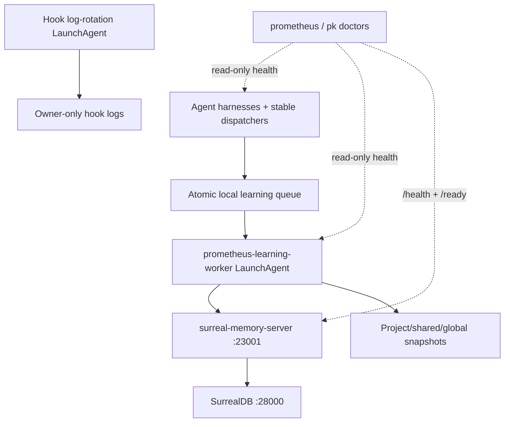

# Doctors and Mac certification

Run diagnosis with explicit exclusions before any repair:

```bash
prometheus doctor --json \
  --exclude control.kbd-runtime \
  --exclude state.kbd-orchestrator \
  --exclude control.kbd-rollout \
  --exclude remote-queue
```

Selection happens before excluded checks are constructed or executed. The report’s `selection` object records the requested check filter and exclusions.

Generate a non-mutating repair plan:

```bash
prometheus doctor --json --refresh --dry-run \
  --exclude control.kbd-runtime \
  --exclude state.kbd-orchestrator \
  --exclude control.kbd-rollout \
  --exclude remote-queue
```

Review every action. Apply only safe, reversible, in-scope actions with explicit confirmation.

## Learning checks

`prometheus doctor` reports the learning pipeline as three separate checks so that a slow receipt is never confused with a dead worker.

| Check | Required | Passes when | Repair |
|---|---|---|---|
| `learning.worker` | yes | `~/.local/bin/prometheus-learning-worker` exists and its service is loaded (`launchctl` on macOS, `systemctl --user` elsewhere) | `bash scripts/install-mcp-services.sh --restart` |
| `learning.queue` | no (never fails the run) | no record has been waiting longer than the stale threshold | see below |
| `learning.snapshots` | yes | project, shared and global each have a committed generation | `pk snapshot` in the canonical checkout |

**Queue staleness.** `learning.queue` reads `PROMETHEUS_LEARNING_QUEUE` (default `~/.prometheus/learning-queue`). A record in `pending`, `processing`, `memory/pending`, `memory/submitting` or `memory/accepted` is in flight, and passes, until it has gone unchanged for longer than `PROMETHEUS_LEARNING_STALE_AFTER` (default `6h`, the same default as the worker's `--stale-after`). Age follows the worker: `lastReceiptChangeAt`, else `firstAcceptedAt`, else `queuedAt`, else the file's modification time. Older records produce a warning, never a failure, so a backlog cannot fail `./install.sh`. Details list per-state counts (including `memory/stalled`), the oldest age and up to five oldest operation ids. When surreal-memory answers (3 s timeout), they also show `GET /api/v2/operations/stats` (`paused`, `oldest_nonterminal`) and each listed operation's server-side state.

Restarting services will not clear a stale record, because it is waiting on a receipt rather than on a dead process. The suggested actions are operator decisions:

- `prometheus-learning-worker quarantine --older-than 6h --dry-run`, then the same without `--dry-run`, to move stale records to `memory/stalled`;
- `prometheus-learning-worker release --all` to put quarantined records back;
- `POST /api/v2/operations/{id}/retry` or `/reject` to re-drive or dead-letter one operation on the memory server.

**Snapshot root.** `learning.snapshots` resolves the project root in this order: `PROMETHEUS_PROJECT_ROOT`; the nearest ancestor of the working directory with `.prometheus/project.json`; the main worktree, when the working directory is a linked git worktree (found with `git rev-parse --path-format=absolute --git-common-dir`); the working directory. Because `.prometheus/project.json` is tracked, a linked worktree contains it, so a linked worktree that has no project snapshot of its own defers to the main worktree when that one has one. The check prints the resolved root and where it came from. If the project snapshot is missing in a linked worktree, the check names the main worktree and warns against running `pk snapshot` in the linked one, which would create a divergent store.

## Allowed health matrix

Run and archive redacted output for:

- canonical `prometheus doctor --json` and `npm run doctor` parity;
- `pk doctor --json`;
- `codex doctor --json`;
- `cowork doctor`, `cowork toolchain status`, and `cowork toolchain check`;
- `scripts/prometheus-services.sh doctor`;
- `scripts/check-mcp-health.sh --json`;
- `prometheus learning status --json`;
- root smoke tests and `pk` health fixtures.

## Deployment topology


```mermaid
flowchart TD
  Harnesses["Agent harnesses + stable dispatchers"] --> Queue["Atomic local learning queue"]
  Queue --> Worker["prometheus-learning-worker LaunchAgent"]
  Worker --> Memory["surreal-memory-server :23001"]
  Memory --> DB["SurrealDB :28000"]
  Worker --> Snapshots["Project/shared/global snapshots"]
  Rotation["Hook log-rotation LaunchAgent"] --> Logs["Owner-only hook logs"]
  CLI["prometheus / pk doctors"] -. read-only health .-> Harnesses
  CLI -. read-only health .-> Worker
  CLI -. /health + /ready .-> Memory
```

## Certification evidence

Required checks must be green. Every warning needs a written disposition. Archive exact command, exit code, commit, timestamp, sanitized environment, and report path. Run `scripts/certify-memory-operations.sh --long-memory` separately because it intentionally writes a certification memory; doctor remains diagnostic.
