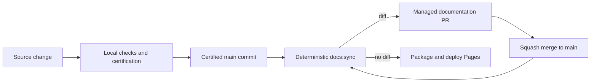

# Local validation and documentation automation

Prometheus certifies code on the release Mac. Hosted jobs are not used as a
development loop or as evidence that runtime, tests, doctors, installers, or
security checks passed.

## Agent freedom and final integrity

Bash, Python, Edit, and Write remain unrestricted. There is no shell parser,
command allow-list, or `PreToolUse` test guard. This keeps ordinary development,
fixture generation, and exploratory work possible.

Protected BDD integrity is checked at final local certification by comparing Git
objects for the certified base and candidate commits. Modification, deletion,
rename, or mode change is detected regardless of which tool performed it.
Intentional protected-test changes require a canonical SSH-signed approval
manifest under the `prometheus-test-change` namespace and a checked-in
allowed-signers policy. Missing approval does not interrupt development; it
fails certification.

Adversarial review is cumulative from the last accepted local receipt. A judge
outage produces `pending_review`; final certification requires a completed
receipt or an SSH-signed waiver.

## What GitHub may do

Only two hosted automation classes are allowed:

1. deterministic documentation synchronization after a push to `main`; and
2. packaging and deployment of the already-synchronized Docusaurus site.

The docs-sync workflow may update only managed blocks on the reusable
`automation/docs-sync` branch. It does not run `docs:check`, tests, lint,
doctors, builds, or certification. A local workflow-policy check rejects those
behaviors and rejects PR validation triggers.

The sync PR is bot-managed, squash-auto-merged, and protected by concurrency
cancellation. Its merge retriggers sync; a correct generator produces no diff
on the second run.

## Local release sequence

1. Run `npm run docs:sync` and confirm a second run is clean.
2. Run the complete local `npm run docs:check` gate.
3. Run all affected language, installer, plugin, and runtime checks locally.
4. Run applicable doctors with the documented KBD and Sovereign exclusions.
5. Archive redacted command results and warning dispositions.
6. Review `git diff`, commit, and push once.

GitHub workflow output can confirm that managed docs were synchronized and Pages
was packaged. It is never certification evidence.
