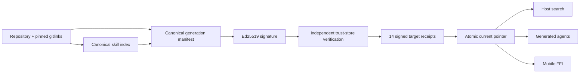

# Signing, indexes, and receipts

Each plugin generation is a signed, immutable transaction containing the
payload and every search-index projection. Activation changes one pointer, so a
host cannot run one generation while agents or mobile clients search another.

## Provenance and trust

The manifest includes the source commit, source-tree state, external source
gitlink commit SHAs, every file hash and mode, target payload modes, hook bundle
identity, and the canonical skill-index hash. It is signed with Ed25519. The
private key and `trust/allowed-signers.json` use private permissions and are not
part of the generation payload.

First installation can enroll the local signer only when no trust store exists.
Once a trust store exists, an unknown signer is rejected. Verification checks
the public-key fingerprint, signature envelope, canonical manifest bytes, file
inventory, and index receipts before activation.

## One index implementation

The generation carries byte-identical host, generated-agent, and mobile index
projections. The shared Rust `skill-index` crate verifies the index SHA-256 and
provides deterministic ranking. Sovereign host search and mobile FFI call that
same selector. A parity receipt prevents a target-specific index from drifting
silently.

## Target receipts and collisions

All 14 supported targets receive a signed receipt containing the generation,
signer, payload mode, payload hash, and skill-index hash. Symlink and copy
targets are verified according to their projection mode. A missing, unsigned,
or mismatched receipt fails verification.

Existing non-owned paths and bundle identities are collisions, not files to
overwrite. A bundle name may be reused only when it resolves inside the
generation store and its verified bundle identity and dispatcher hash match.

## Activation and rollback

The installer verifies a complete staged generation, writes signed receipts,
updates `previous`, and atomically switches `current`. Stable dispatchers and
the stable index resolve through `current`. Rollback selects `previous`,
reprojects copy targets, verifies all receipts, and then swaps the pointers.

Use `node scripts/install-plugin-generation.js --verify` for a read-only check.
Tampering with payload, manifest, signature, trust store, index, receipt, or
pointer is a hard failure.
