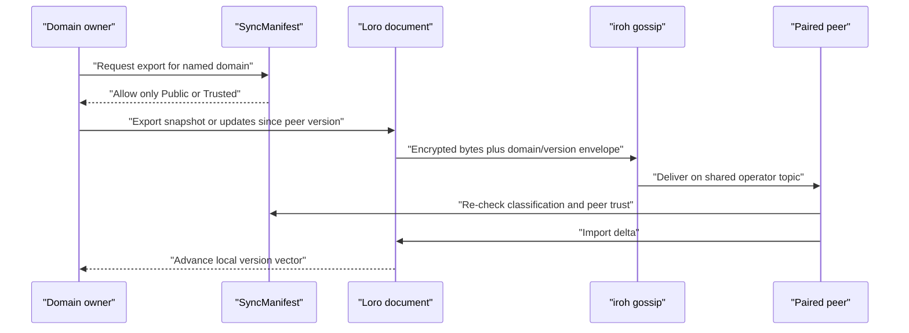

# Sovereign Sync Architecture

## Technology stack

| Component | Crate | Version | Purpose |
|---|---|---|---|
| P2P transport | `iroh` | 1.0.x | Encrypted QUIC connectivity, discovery, NAT traversal, relays |
| Gossip protocol | `iroh-gossip` | 0.101 | Topic-based broadcast to a connected peer set |
| CRDT engine | `loro` | 1.13.x | Snapshot, delta, version-vector, and conflict-free merge primitives |
| Domain storage | `storage-provider` | workspace | Local, Loro, and iroh-docs adapters plus the sync manifest |
| KBD authority | `kbd-runtime` | workspace | Flocked journal writes, signed events, deterministic replay, project identity |
| General sync persistence | `redb` | 2.x | Sovereign Sync's non-KBD `state.redb` store |
| MCP server | `rmcp` | 1.8.0 | Harness tool surface |
| HTTP server | `axum` | 0.8 | Loopback REST API and AG-UI SSE |
| Rust SDK | `sovereign-client` | 0.1.0 | REST, signed KBD command, claims, and typed SSE client |

## Topic derivation

Every operator group shares a gossip topic derived from its operator ID:

```text
operator_key = BLAKE3(UTF8(operator_id))
topic        = BLAKE3(operator_key || "sovereign-sync-v1")
```

All devices with the same `node.operator_id` value in
`$HOME/.config/sovereign-sync/config.toml` derive the same topic. That equality
is necessary but not sufficient: a node must also know at least one peer
endpoint ID to join an existing mesh.

`operator_id` is configuration, not a command-line flag, endpoint ID, device
signing key, or project ID.

## SyncManifest

`SyncManifest` is a default-deny registry. A domain is a string name plus the
storage-key prefix it owns:

```rust
pub enum PrivacyClass {
    Public,  // eligible for paired-peer replication
    Trusted, // eligible only for explicitly trusted peers
    Local,   // never eligible for P2P export or import
}

pub struct SyncDomain(pub String);

pub struct DomainConfig {
    pub privacy: PrivacyClass,
    pub key_prefix: String,
}
```

Unregistered domains and `Local` domains both fail `is_syncable()`. `Public`
does not mean plaintext: iroh still encrypts transport. It means the content
owner has classified the payload as safe for any paired peer.

## Two different convergence problems

Sovereign Sync separates:

1. **Replicated domain data**, where Loro CRDT merge is appropriate.
2. **KBD command authority**, where journal writes require one atomic writer
   during the Loro authority migration.

KBD currently commits through one exclusive-flock journal transaction and
rejects stale revisions. Multi-writer convergence is introduced through the
project Loro document rather than an unjoined consensus configuration.

The canonical KBD runtime lives outside the repository under the platform
application-data root:

```text
<data-root>/prometheus/kbd/projects/<project-id>/
```

The repository’s `.prometheus/project.json` supplies the immutable project ID.
Files such as `.kbd-orchestrator/current-waypoint.json`, `position.json`, and
phase `progress.json` are compatibility projections or authored workflow
artifacts; they are not a second command authority.

## CRDT merge

Domains use Loro for conflict-free snapshots and deltas:

```rust
doc.export(ExportMode::Snapshot)?

doc.export(ExportMode::Updates {
    from: Cow::Owned(version_vector),
})?

doc.import(delta)?
```

The learner-model crate stores one CRDT document at
`learner/<learner-id>/model.crdt`. Its typed content includes concepts,
mastery observations, gaps, sessions, and FSRS cards. The store exposes a
`merge_delta()` operation. The daemon's domain adapter exports the local model,
merges Loro updates, and persists the converged typed value.

## KBD control-plane storage

KBD stores one authoritative `project.loro` document per project and one
append-only `replicas/<replica-id>/events.jsonl` write-ahead journal plus lock
per replica. Each command holds the replica lock across fold, validation,
event preparation, append, and journal fsync, then imports/fsyncs Loro before
compatibility projections are updated.
`redb` is not part of the KBD authority; it remains only for the general sync
store in `store.rs`.

Every committed event is verified by the `kbd-runtime` signature/hash chain.
Diagnostics report replica journal path/size/Lamport, ingestion state, Loro
snapshot status/frontier/conflicts, lock and single-writer compatibility,
projection revision, device trust counts, and signature-chain validity.
The compatibility quorum configuration accepts exactly one local writer and
rejects multi-voter settings.

The `kbd-control:<project-id>` gossip domain exports the complete Loro update
set from `project.loro`, wraps it with auxiliary presence, and signs the wire
envelope with an enrolled project device. Receivers verify project identity,
active device membership, envelope signature, every event signature/hash, and
grow-only semantics before fsyncing the merged authority. Replicas on one
machine converge through the shared document path without a network hop.

## P2P endpoint lifecycle

The daemon builds an iroh endpoint with `presets::N0`. Because it does not pass
a persistent iroh secret key to the endpoint builder, iroh generates a new
endpoint key at each daemon start. Consequently:

- the endpoint ID is unique per running process;
- it is printed in startup logs;
- it is not the KBD `device-key.json` identity;
- bootstrap IDs become stale when the bootstrap daemon restarts.

Persistent endpoint identity, a pairing/export command, live peer
observability, and peer allow-list enforcement are required before pairing is
durable enough for production use.

## Intended domain data flow



The daemon retains the incoming receiver and implements this sequence for
skill index, learner model, and signed KBD project authority domains.

## MCP server tools

In `--mode mcp`, Sovereign Sync exposes four discovery/sync/search tools and six
KBD tools:

| Family | Tools |
|---|---|
| Discovery/sync | `search-skills`, `sync-status`, `sync-push`, `sync-peers` |
| KBD read/control | `kbd_status`, `kbd_events`, `kbd_pause`, `kbd_revise`, `kbd_resume`, `kbd_cancel` |

The CLI accepts `--prefix-tools` and logs the requested prefix mode, but the
generated router still exposes the stable names above.

## Current verification boundary

The repository proves these pieces separately:

- manifest default-deny and `Local` rejection;
- Loro snapshot export/import and version vectors;
- deterministic topic derivation;
- iroh-docs two-node sharing in the storage-provider crate;
- signed KBD envelopes and real domain push/import paths;
- single-voter KBD command ordering and embedded quorum behavior.

The test battery proves two-node domain merge without live internet discovery;
final deployment certification separately exercises real iroh peer discovery,
signed KBD convergence, and applied-frontier reporting.

---
*Canonical source: [`substrate/sovereign-sync`](https://github.com/Prometheus-AGS/prometheus-skill-system/tree/main/substrate/sovereign-sync).*
