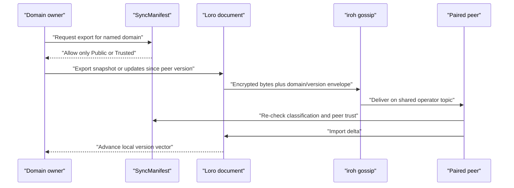

# Sovereign Sync Architecture

## Technology stack

| Component | Crate | Version | Purpose |
|---|---|---|---|
| P2P transport | `iroh` | 1.0.x | Encrypted QUIC connectivity, discovery, NAT traversal, relays |
| Gossip protocol | `iroh-gossip` | 0.101 | Topic-based broadcast to a connected peer set |
| CRDT engine | `loro` | 1.13.x | Snapshot, delta, version-vector, and conflict-free merge primitives |
| Domain storage | `storage-provider` | workspace | Local, Loro, and iroh-docs adapters plus the sync manifest |
| KBD consensus | `openraft` | =0.9.21 | Ordered commands, membership, snapshots, and fencing |
| KBD persistence | `redb` | 2.x | Raft log, state machine, command results, projections |
| KBD runtime | `kbd-runtime` | workspace | Signed events, deterministic replay, project identity |
| MCP server | `rmcp` | 1.8.0 | Harness tool surface |
| HTTP server | `axum` | 0.8 | Loopback REST API and AG-UI SSE |
| Rust SDK | `sovereign-client` | 0.1.0 | REST/SSE client; bearer-token support remains pending |

## Topic derivation

Every operator group shares a gossip topic derived from its operator ID:

```text
operator_key = BLAKE3(UTF8(operator_id))
topic        = BLAKE3(operator_key || "sovereign-sync-v1")
```

All devices with the same `node.operator_id` value in
`$HOME/.config/sovereign-sync/config.toml` derive the same topic. That equality
is necessary but not sufficient: a node must also know at least one peer
endpoint ID to join an existing mesh.

`operator_id` is configuration, not a command-line flag, endpoint ID, signing
key, HTTP bearer token, or project ID.

## SyncManifest

`SyncManifest` is a default-deny registry. A domain is a string name plus the
storage-key prefix it owns:

```rust
pub enum PrivacyClass {
    Public,  // eligible for paired-peer replication
    Trusted, // eligible only for explicitly trusted peers
    Local,   // never eligible for P2P export or import
}

pub struct SyncDomain(pub String);

pub struct DomainConfig {
    pub privacy: PrivacyClass,
    pub key_prefix: String,
}
```

Unregistered domains and `Local` domains both fail `is_syncable()`. `Public`
does not mean plaintext: iroh still encrypts transport. It means the content
owner has classified the payload as safe for any paired peer.

## Two different convergence problems

Sovereign Sync separates:

1. **Replicated domain data**, where Loro CRDT merge is appropriate.
2. **KBD command authority**, where a single ordered, fenced event chain is
   required.

Merging two offline KBD writer branches would preserve bytes but destroy causal
authority. KBD therefore commits commands through OpenRaft and rejects stale
expected revisions, leases, and fencing tokens.

The canonical KBD runtime lives outside the repository under the platform
application-data root:

```text
<data-root>/prometheus/kbd/projects/<project-id>/
```

The repository’s `.prometheus/project.json` supplies the immutable project ID.
Files such as `.kbd-orchestrator/current-waypoint.json`, `position.json`, and
phase `progress.json` are compatibility projections or authored workflow
artifacts; they are not a second command authority.

## CRDT merge

Domains use Loro for conflict-free snapshots and deltas:

```rust
doc.export(ExportMode::Snapshot)?

doc.export(ExportMode::Updates {
    from: Cow::Owned(version_vector),
})?

doc.import(delta)?
```

The learner-model crate stores one CRDT document at
`learner/<learner-id>/model.crdt`. Its typed content includes concepts,
mastery observations, gaps, sessions, and FSRS cards. The store exposes a
`merge_delta()` operation, but the daemon does not yet read that directory,
export its deltas, or call the merge operation for incoming P2P messages.

## KBD control-plane storage

OpenRaft uses redb for:

- vote and membership state;
- ordered log entries;
- deterministic KBD state-machine application;
- snapshots;
- idempotent command results;
- compatibility-projection revision metadata.

Every committed event is verified by the `kbd-runtime` signature/hash chain.
Diagnostics report quorum state, leader and term, commit/apply lag, snapshot
index, projection revision, device trust counts, and signature-chain validity.

Single-voter mode is writable but not highly available. Multi-voter behavior is
tested with an embedded in-process transport. The daemon refuses normal
multi-voter startup because authenticated cross-process Raft transport is not
yet connected.

## P2P endpoint lifecycle

The daemon builds an iroh endpoint with `presets::N0`. Because it does not pass
a persistent iroh secret key to the endpoint builder, iroh generates a new
endpoint key at each daemon start. Consequently:

- the endpoint ID is unique per running process;
- it is printed in startup logs;
- it is not the KBD `device-key.json` identity;
- bootstrap IDs become stale when the bootstrap daemon restarts.

Persistent endpoint identity, a pairing/export command, live peer
observability, and peer allow-list enforcement are required before pairing is
durable enough for production use.

## Intended domain data flow



The `0.1.0` daemon currently stops before this sequence: it creates the P2P
node, but it does not retain the incoming receiver, create the domain envelope,
connect a domain owner, or advance versions after delivery.

## MCP server tools

In `--mode mcp`, Sovereign Sync exposes four discovery/sync/search tools and ten
KBD tools:

| Family | Tools |
|---|---|
| Discovery/sync | `search-skills`, `sync-status`, `sync-push`, `sync-peers` |
| KBD read/control | `kbd_status`, `kbd_events`, `kbd_pause`, `kbd_revise`, `kbd_resume`, `kbd_cancel` |
| KBD lease | `kbd_claim`, `kbd_heartbeat`, `kbd_release`, `kbd_handoff` |

The CLI accepts `--prefix-tools` and logs the requested prefix mode, but the
generated router still exposes the stable names above.

## Current verification boundary

The repository proves these pieces separately:

- manifest default-deny and `Local` rejection;
- Loro snapshot export/import and version vectors;
- deterministic topic derivation;
- iroh-docs two-node sharing in the storage-provider crate;
- REST authentication and queue acknowledgement;
- single-voter KBD command ordering and embedded quorum behavior.

It does not yet prove one two-machine daemon workflow that discovers peers,
exports a real producer’s state, transmits it, imports it, and reports the
applied version. A successful health check, queue acknowledgement, or matching
topic is not evidence that project data was replicated.

---
*Canonical source: [`substrate/sovereign-sync`](https://github.com/Prometheus-AGS/prometheus-skill-system/tree/main/substrate/sovereign-sync).*
