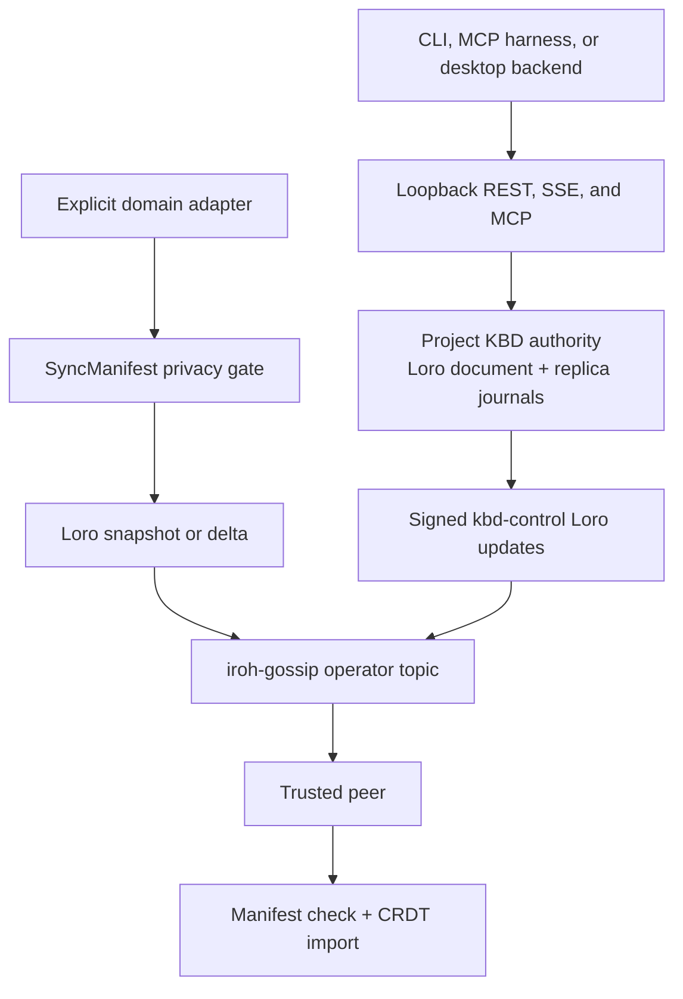

# Sovereign Sync

Sovereign Sync is the Prometheus service intended to let trusted machines carry
the same operational context without turning one machine into a public server.
It combines:

- an iroh peer-to-peer connection layer;
- Loro conflict-free replicated data types (CRDTs) for mergeable data;
- a privacy manifest that decides which named data domains may leave a device;
- a loopback API, device-signed KBD command surface, and MCP tools; and
- the local KBD command authority used by Claude Code, Codex, OpenCode, Kimi,
  and CLI operators.

The design goal is continuity: a user should be able to stop work on one
trusted machine and resume on another with the relevant project position,
learning state, and approved knowledge already present.

:::info Current release boundary

Signed `kbd-control:<project-id>` Loro updates and auxiliary presence now flow
over the iroh gossip transport, while `skill-index` and `learner-model` use
their explicit domain adapters. Other project/global artifact families remain
adapter work and are not copied merely because files exist on disk.

:::

## Why sync exists

Prometheus produces useful state outside the source tree:

- KBD knows the active phase, next command, progress, decisions, and
  checkpoints;
- the Feynman system records mastery, knowledge gaps, observations, sessions,
  and FSRS review schedules;
- the Karpathy learning loop produces project and shared wiki entries,
  reflection events, learning logs, and skill-improvement candidates;
- the outer loop, evolver, ZeeSpec, Forge, and skill creator each maintain
  resumable state.

Git remains the right way to exchange source code and reviewed documentation.
It is not a live state transport for every runtime database, local learning
record, or in-progress loop. Sovereign Sync is intended to fill that gap with
explicitly classified, peer-to-peer replication.

## The intended operating model

1. Install Sovereign Sync on each trusted machine.
2. Give the machines the same **operator ID** so they derive the same private
   gossip topic.
3. Exchange their distinct **iroh endpoint IDs** so at least one machine can
   bootstrap a connection.
4. Keep the same immutable **project ID** for clones of the same repository.
5. Register an explicit sync domain with `Public`, `Trusted`, or `Local`
   privacy.
6. Convert the domain owner’s state into a CRDT snapshot or delta.
7. Send the encrypted payload to authorized peers.
8. Merge it into the matching domain and advance its version vector.

Steps 5–8 are wired for the registered KBD authority and the implemented
domain adapters. Every additional artifact family still requires an explicit
privacy classification and adapter.

## Three planes, three different jobs

| Plane | Purpose | Scope today |
|---|---|---|
| Local control | REST, SSE, MCP, KBD commands, search | Routes every registered project by immutable UUID |
| P2P connectivity | Endpoint discovery, NAT traversal, relay fallback, gossip topic | Starts in daemon mode; pairing is log-driven |
| Domain replication | Manifest gate, CRDT export/import, per-domain versions | Library-tested; not connected to daemon data sources |

The KBD authority is a grow-only Loro event map fed by per-replica signed,
hash-chained journals. Generic domains use their own explicitly registered
CRDT adapters.

## What sync is not

Sovereign Sync is not:

- a replacement for Git, package managers, or the skill installer;
- a backup system or historical archive;
- remote access to the loopback REST API;
- a folder mirroring tool that copies everything under `.prometheus/`;
- permission to transmit a domain merely because a file exists;
- permission to hide KBD conflicts produced by independent offline writers;
- a reason to copy device keys or other credentials.

## Architecture



See [Architecture](./architecture) for the component and trust boundaries.

## Command modes

| Mode | When to use | Port |
|---|---|---|
| `--mode init` | Create the local KBD device-signing key | none |
| `--mode mcp` | Let a harness call search, sync-summary, and KBD tools | stdio |
| `--mode daemon` | Start P2P setup and the local HTTP/KBD service | loopback `7892` |
| `--mode server` | Start only the local HTTP/KBD service for debugging | loopback `7892` |
| `--mode status` | Probe the local daemon health route | none |

## Quick start

```bash
# Build/install tools and managed services
bash scripts/check-prerequisites.sh --install --build-tools
bash scripts/install-mcp-services.sh

# Verify the daemon is up
curl --fail-with-body http://127.0.0.1:7892/health | jq .

# Read the current bounded sync summary
/sync-status
```

The HTTP service is intentionally loopback-only. KBD mutation POSTs require a
device-signed schema-v2 command; read routes do not use the removed bearer-token
scheme. See [Identity and authentication](/docs/kbd/tokens-and-authentication).

## Read next

- [Pair two machines](./pair-two-machines) explains every identifier and the
  current log-driven bootstrap procedure.
- [Network configuration](./p2p-network) covers same-LAN, different-network,
  VPN, firewall, relay, and air-gapped constraints.
- [Exactly what syncs](./data-scope) inventories project and global data,
  including every loop and Karpathy artifact family.
- [Real-world use cases](./use-cases) shows the operator value and the current
  workaround for each scenario.

---
*Canonical source: [`substrate/sovereign-sync`](https://github.com/Prometheus-AGS/prometheus-skill-system/tree/main/substrate/sovereign-sync) — the crate and its doc comments are the source of truth.*
