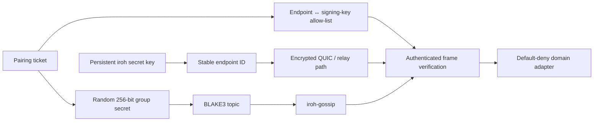

# P2P Network

Sovereign Sync uses iroh QUIC and iroh-gossip. Transport encryption is necessary
but not the authorization boundary: a frame must also arrive on the secret-derived
group topic and pass the endpoint/signing-key allow-list, freshness, replay, target,
and domain checks.

## Discovery and relay behavior

The current endpoint preset may use N0 discovery and relays when direct UDP
paths are unavailable. Corporate firewalls, VPNs, captive networks, and offline
LANs require deployment-specific validation. A relay can forward encrypted
traffic but does not learn the group secret or satisfy application authorization.

## Bootstrap

`peers.bootstrap` contains stable iroh endpoint IDs for already enrolled peers.
It does not accept IP addresses, HTTP URLs, project IDs, or pairing tickets.
Bootstrap provides reachability; `pair-import` provides the secret and allow-list
binding. Both are required for an authenticated group connection.

## Failure diagnosis

| Symptom | Check |
|---|---|
| Local API unavailable | Unix socket path, owner, mode `0600`, and same-user peer credentials |
| TCP returns `401` | Explicit `--tcp` token file exists, is mode `0600`, and bearer token matches |
| Endpoint changes after restart | P2P identity path is stable, regular, mode `0600`, and writable atomically |
| Peer reachable but frames rejected | Both sides imported tickets and endpoint/fingerprint bindings match |
| Push remains `broadcast` | Inspect per-peer receipts; reachability is not application evidence |
| `stale_request` or replay rejection | Correct clocks and submit a new request ID; do not reuse a signed stale frame |

Never log complete pairing tickets, group secrets, bearer tokens, or private
identity files. Release evidence records redacted paths, fingerprints, endpoint
IDs, and receipt state only.
