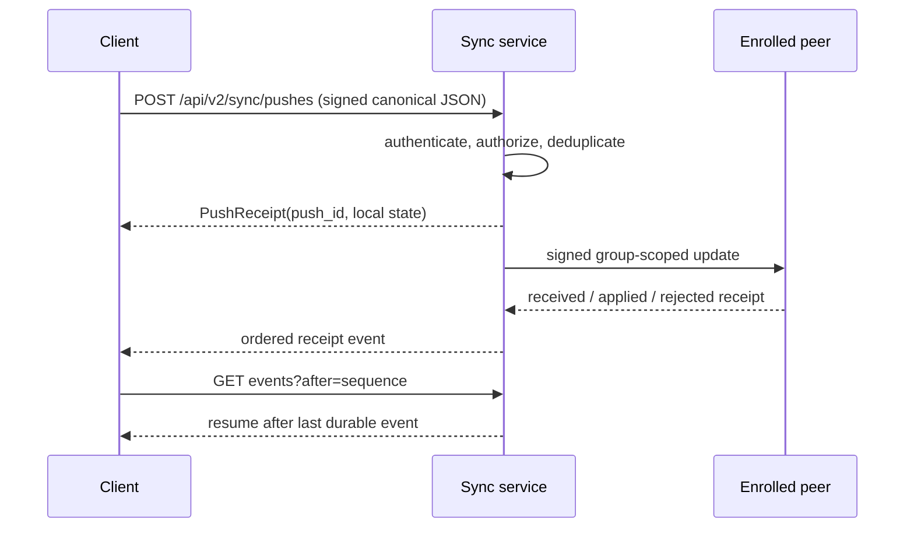

# Signed pushes and receipts

A sync push is a durable operation, not a fire-and-forget RPC. REST and MCP both
call the same push service, so transport choice does not change identity,
authorization, replay, or receipt semantics.

## Request identity

`SignedSyncPushRequest` includes a schema version, request ID, sync domain,
optional target endpoint IDs, optional expected frontier, issue time, signer key
ID, and signature. The signature covers RFC 8785 canonical JSON with the
`signature` field omitted. The canonical payload hash is stored with the push.

A request is accepted only when:

- its signer and endpoint binding are enrolled in the allow-list;
- its group secret selects the expected private topic;
- its issue time is within the allowed freshness window;
- its signature matches the enrolled key; and
- its request ID has not been used with a different canonical payload.

## Exact replay and conflict

Retrying the same request ID with the same canonical payload returns the same
push identity and receipt. Reusing that ID with a different payload returns
`409`. This gives clients a safe response-loss strategy: retry the original
request, then read the receipt instead of inventing a second push.

`PushReceipt` records the canonical hash, targets, local state, per-peer
received/applied/rejected state, timestamps, and failure details. Events have a
monotonic sequence. Reconnect with `after=<last-sequence>` to receive only later
events.

## Transport boundary

The default local endpoint is an atomically created mode-`0600` Unix socket.
The server verifies same-user peer credentials using the platform credential
API. Loopback TCP is opt-in and requires a bearer token from a mode-`0600`
file.

The deprecated v1 unsigned push is available only over the same-user Unix
socket during the 1.7 transition and returns deprecation metadata. TCP and P2P
reject it.

## Failure handling

The API uses one error envelope for `400`, `401`, `403`, `404`, `409`, `422`,
and `503`. Authentication and authorization failures are distinct from payload
validation, conflicts, missing pushes, and temporary readiness failures. Never
translate an empty or failed peer response into an applied receipt.

See the [REST API](./rest-api) for fields and examples and [Pair two machines](./pair-two-machines)
for the durable endpoint identity and pairing-ticket ceremony.
